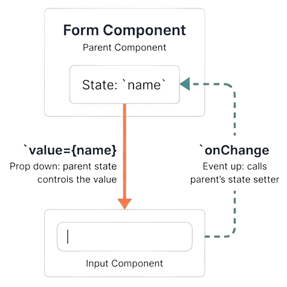

# Comunicación entre Componentes en Angular

## 1. Introducción a la Comunicación en Angular

!!! note "¿Qué es la comunicación entre componentes?"
    La comunicación entre componentes en Angular es el conjunto de mecanismos que permiten intercambiar datos y eventos entre diversos componentes, manteniendo el principio de aislamiento y evitando dependencias directas.

!!! tip "Recordemos que..."
    El framework Angular sigue una **arquitectura por componentes**, dónde cada componente:
    - Debe estar aislado.
    - Debe ser reutilizable en más de una ocasión.
    - Debe tener una responsabilidad clara.

### **¿Por qué surge este problema?**
El problema es el principio de aislamiento de Angular. El framework no permite que un componente acceda libremente a otro. En su lugar, obliga a usar canales de comunicación alternativos, que deben estar bien definidos.

!!! success "Beneficios de este Aislamiento:"

    - Código más mantenible
    - Menor acoplamiento
    - Mejor escalabilidad
    - Mayor claridad en el flujo de datos

El objetivo es que cada componente de la web cumpla su responsabilidad sin conocer la como funcionan los demás.

### **¿Cómo se comunican los componentes sin romper el aislamiento?**
Para comunicarse, los componentes emplean un método de comunicación explícita, llamado Data Down, Events Up. 


## 2. Arquitectura Padre – Hijo

Antes de entrar en código, entendamos los **roles de los componentes**:
Existen dos tipos de componentes, componentes hijos y componentes padres, según el tipo de estos, elevan eventos o bajan datos. Por tanto, el tipo de componente es crucial.




!!! info "Componente Padre (Smart)"
    También llamado *componente inteligente*.

    **Características:**
    
    * **Gestiona datos reales:** Maneja las listas y el estado.
    * **Conexión externa:** Se comunica con servicios y APIs.
    * **Toma de decisiones:** Decide qué hacer ante un evento.

    **Ejemplos típicos:**
    
    * Página de listado.
    * Dashboard.
    * Contenedor de formularios.

!!! info "Componente Hijo (Dumb)"
    También llamado *componente de presentación*.

    **Características:**
    * **Pasividad:** Recibe los datos ya procesados y listos para mostrar.
    * **Enfoque visual:** Su única responsabilidad es pintar la interfaz (UI).
    * **Aislamiento total:** No sabe de dónde vienen los datos ni quién los procesa.
    * **Sin efectos secundarios:** No modifica directamente el estado global, solo avisa hacia arriba.

    **Ejemplos típicos:**
    * Tarjetas de usuario (`UserCard`).
    * Botones personalizados.
    * Elementos individuales de una lista.

Esta separación hace la app **más fácil de mantener, testear y reutilizar**.

## 3. `@Input()`: Enviando datos hacia abajo (Padre ➡ Hijo)

El decorador `@Input()` es la forma en que un componente hijo abre una "puerta" para que entren datos. Sin `@Input`, las variables de un componente son privadas y nadie desde fuera puede modificarlas.

!!! info "¿Cómo funciona?"
    Piensa en `@Input()` como un parámetro de una función. Cuando defines una función `sumar(a, b)`, `a` y `b` son inputs. Aquí, las propiedades del componente actúan igual.

### Implementación Paso a Paso

#### A. En el Componente Hijo (`TaskCardComponent`)
Debemos importar `Input` y decorar la propiedad que queremos exponer.

```TypeScript
// task-card.component.ts
import { Component, Input } from '@angular/core';

@Component({
  selector: 'app-task-card',
  standalone: true,
  template: `
    <article class="task-card">
      <h3>{{ title }}</h3>
      <span class="status">{{ isDone ? '✅ Completada' : '⏳ Pendiente' }}</span>
    </article>
  `
})
export class TaskCardComponent {
  // @Input() marca esta propiedad como "rellenable" desde el padre.
  // Si el padre no envía nada, usará el valor por defecto ('Sin título').
  @Input() title: string = 'Sin título';

  // Podemos tener tantos inputs como necesitemos.
  @Input() isDone: boolean = false;
}
```

## B. En el Componente Padre (TaskListComponent)

El padre utiliza el **Property Binding** (los corchetes `[ ]`) para conectar sus datos con los inputs del hijo.

!!! caution "Regla de Oro:" 
    Los corchetes `[ ]` significan: "Angular, evalúa lo que hay dentro de las comillas como código (variable), no como texto plano".

```TypeScript 
// task-list.component.ts
import { Component } from '@angular/core';
import { TaskCardComponent } from './task-card.component';

@Component({
  selector: 'app-task-list',
  standalone: true,
  imports: [TaskCardComponent], // ¡Importante importar el componente hijo!
  template: `
    <section>
      <h2>Mis Tareas de Hoy</h2>

      <app-task-card title="Aprender Angular Básico"></app-task-card>

      <app-task-card 
        [title]="tareaActual" 
        [isDone]="estadoTarea">
      </app-task-card>
      
    </section>
  `
})
export class TaskListComponent {
  // Estas son las variables que tiene el padre
  tareaActual = 'Practicar Comunicación entre Componentes';
  estadoTarea = true;
}
``` 

## 4. `@Output()`: Emitiendo eventos hacia arriba (Hijo ➡ Padre)

!!! danger "Un componente hijo NUNCA debe modificar los datos del padre"  
    Si un hijo borra una tarea por su cuenta, el padre no se entera y la aplicación se desincroniza.

!!! info "Principio de Responsabilidad"
    En lugar de actuar por su cuenta, el hijo **emite un evento** (como un grito, o una señal de radio) y el padre, que es el "dueño" de los datos, si así lo quiere, escucha y actúa en consecuencia.

**Los protagonistas de esta comunicación:**

* **`@Output()`**: El decorador que expone el evento hacia afuera del componente.
* **`EventEmitter`**: La clase técnica que nos permite "disparar" o emitir el mensaje.


### **A. En el Componente Hijo (`TaskCardComponent`)**

En el hijo, preparamos el botón y el "emisor" de la señal.

```typescript
// task-card.component.ts
import { Component, Input, Output, EventEmitter } from '@angular/core';

@Component({
  selector: 'app-task-card',
  standalone: true,
  template: `
    <article class="task-card">
      <h3>{{ title }}</h3>
      <button (click)="onDeleteClick()">Eliminar</button>
    </article>
  `
})
export class TaskCardComponent {
  @Input() title: string = '';

  // 1. Creamos el "canal" de comunicación[cite: 101].
  // <string> indica que enviaremos un texto (el título) al padre.
  @Output() deleteRequest = new EventEmitter<string>();

  onDeleteClick() {
    console.log('Hijo: El usuario quiere borrar. Avisando al padre...');
    
    // 2. EMITIR: Lanzamos el evento hacia arriba[cite: 108].
    // Lo que enviamos en emit() es lo que el padre recibirá como $event.
    this.deleteRequest.emit(this.title);
  }
}
```

## B.En el Componente padre (`TaskListComponent`)
El padre utiliza el **Event Binding** (los paréntesis `( )`) para escuchar el evento personalizado que acabamos de crear.

!!! info "El objeto `$event`" 
    Es una palabra reservada en los templates de Angular. Representa el dato exacto que el hijo envió dentro del `.emit()`.

```TypeScript
// task-list.component.ts
import { Component } from '@angular/core';
import { TaskCardComponent } from './task-card.component';

@Component({
  selector: 'app-task-list',
  standalone: true,
  imports: [TaskCardComponent],
  template: `
    <section>
      <app-task-card 
        [title]="'Hacer la compra'"
        (deleteRequest)="borrarTarea($event)">
      </app-task-card>
      
    </section>
  `
})
export class TaskListComponent {

  // Este método se ejecuta SOLO cuando el hijo emite el evento
  borrarTarea(tituloRecibido: string) {
    console.log('Padre: Mensaje recibido.');
    console.log('Elemento a borrar:', tituloRecibido);
    
    // Aquí iría la lógica real para borrarlo de la lista o llamar a la API
    alert('Tarea eliminada: ' + tituloRecibido);
  }
}
```
!!! note "En resumen" 

    | Símbolo | Nombre | Dirección | Significado | Mnemotecnia |
    | :---: | --- | :---: | --- | --- |
    | `[ ]` | **Property Binding** | Padre ➡ Hijo | "Mete este valor en la propiedad del hijo" | Una **Caja [ ]** donde guardas datos. |
    | `( )` | **Event Binding** | Hijo ➡ Padre | "Escucha cuando el hijo grite esto" | Una **Oreja ( )** para escuchar. |

    * **@Input():** Sirve para recibir datos. El padre los inyecta en el hijo. (Dirección: Padre ➡ Hijo). 
    * **@Output():** Sirve para subir avisos o datos. El hijo "grita" algo y el padre lo escucha. (Dirección: Hijo ➡ Padre).

